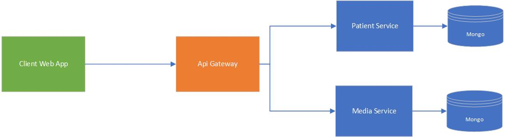

# Microservices and Containers
This repository contains serveral projects that are intended to be used to explore the use of Docker containers and Microservice based architecture. The application consists of two primary microservices:
1. Patient Service
2. Media Service

Each of these services are written in ASP.NET Core and persist data in its own MongoDB database (a NoSQL document database). Additionally, an Api Gateway service is provided that is configured to route incoming API calls to the appropriate Patient or Media service.

A client application written in Angular provides a front end application to display patients and media. It also provides methods to create new patients and upload new media.

## Architecture
The microservice architecture employed in this project can be visualized with the following diagram:


## Projects
The following projects / folders are available in this repo:
1. PatientService - A Patient Service that stores data in MongoDB.
2. MediaService - A Media Service that stores data in MongoDB and media files on disk volume.
3. ApiGateway - An API Gateway service using [Ocelot](https://docs.microsoft.com/en-us/dotnet/architecture/microservices/multi-container-microservice-net-applications/implement-api-gateways-with-ocelot) to route requests to other services.
4. client-web-app - An Angular front end web application for interacting with the services.
5. docker - A folder containing docker-compose files for bringing up all the microservices in docker containers.

## Docker
The best way to get the microservices up and running is to use Docker. While it is possible to compile and run these services individually, the intent is to use Docker. You can install Docker for Windows from [this page](https://docs.docker.com/docker-for-windows/install/). If you do not use Docker, you will need to install MongoDB so the services can store data.

Each project contains its own Dockerfile which provides the instructions for building the container. Additionally, the `docker` folder contains docker-compose files for bringing up all of the necessary containers. You may notice that the docker-compose file contains a service called `mongo`. This container is using the official MongoDB image from [DockerHub](https://hub.docker.com/_/mongo). Prior to using docker-compose to bring up the services, you will need to create a volume for the MongoDB data. Issue the following docker command to create this volume:
```
docker volume create --name=mongo_data
```

## Build and Run
Visual Studio Code should be used to edit and work with the projects. The root folder contains a VS Code workspace that loads all the projects. There are build and launch tasks written for the microservices. If you run the build task (Ctrl-Shift-B), you will see a menu that provides options for building each of the microservices as a native ASP.NET Core app or as a docker image.

The following instructions use Docker to build the microservices and the client application:

1. Open a terminal and change into the `docker` folder.
1. Create a docker volume for MongoDB to store data by issuing the following command: 
   ```
   docker volume create --name=mongo_data
   ```
1. Type the following command to build and start the docker containers (Note that the first time this is issued, the build may take a while as it must download docker images):
   ```
   docker-compose up -d
   ```
1. If the command succeeds, you will have 6 containers running on your system. You can see these in the Docker Dashboard.
1. Open your browser with the url http://localhost:8080
1. Use the green plus button to add patients and media.
1. To bring down the containers, type:
   ```
   docker-compose down
   ```

## Hosting in the Cloud
This application can easily be hosted in a cloud service, such as, Azure or AWS. The individual services can be hosted as web applications and an API Gateway from the cloud provider can be used instead of the Ocelot version provided here. Alternatively, the docker images can be uploaded and used by the cloud provider's container orchestration tool (i.e., AKS on Azure).

## Challenges and Future Development
One of the main reasons for creating this prototype was to explore the performance of storing large media files in the cloud. We can expect that uploading and downloading large datasets will impact performance. This prototype can be used to further explore ways to improve performance.